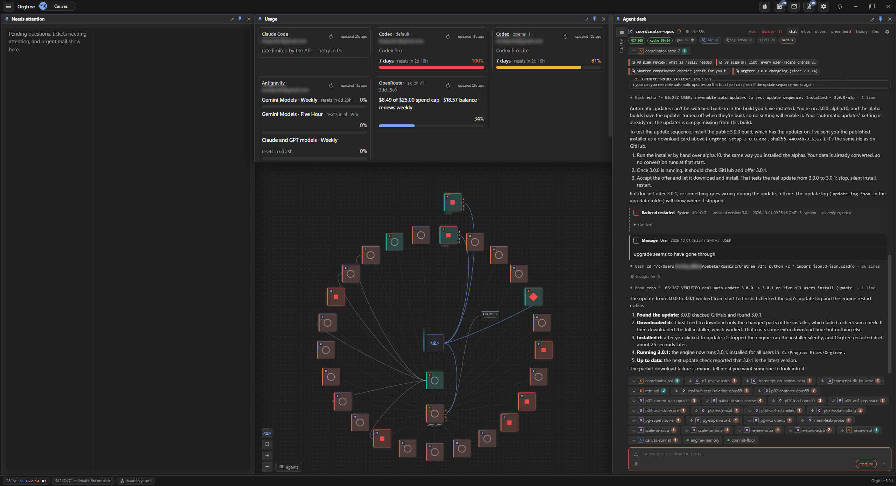
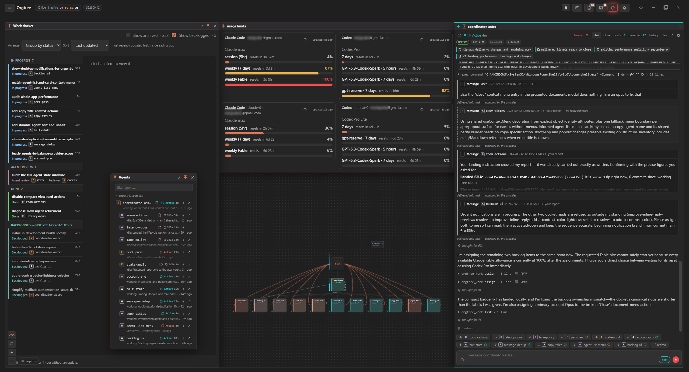
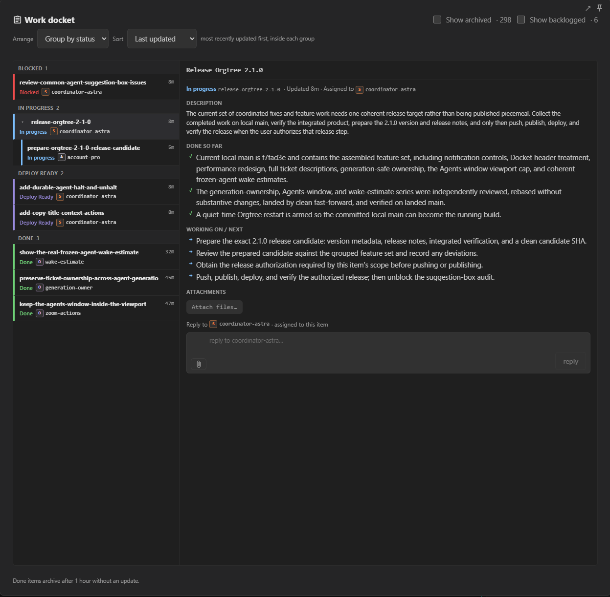
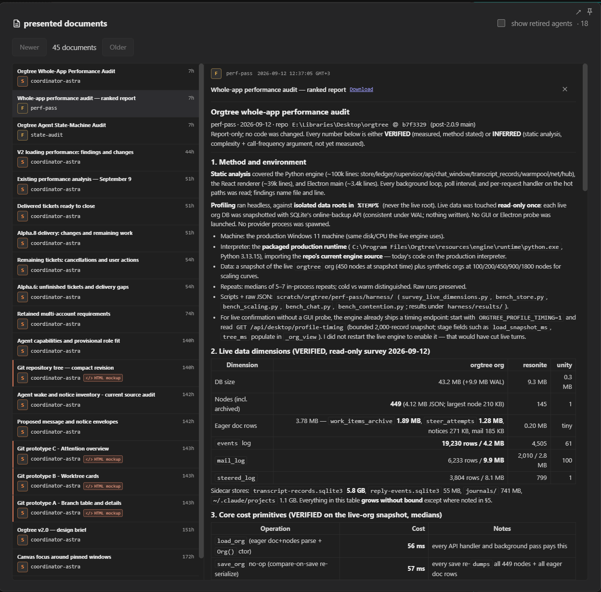
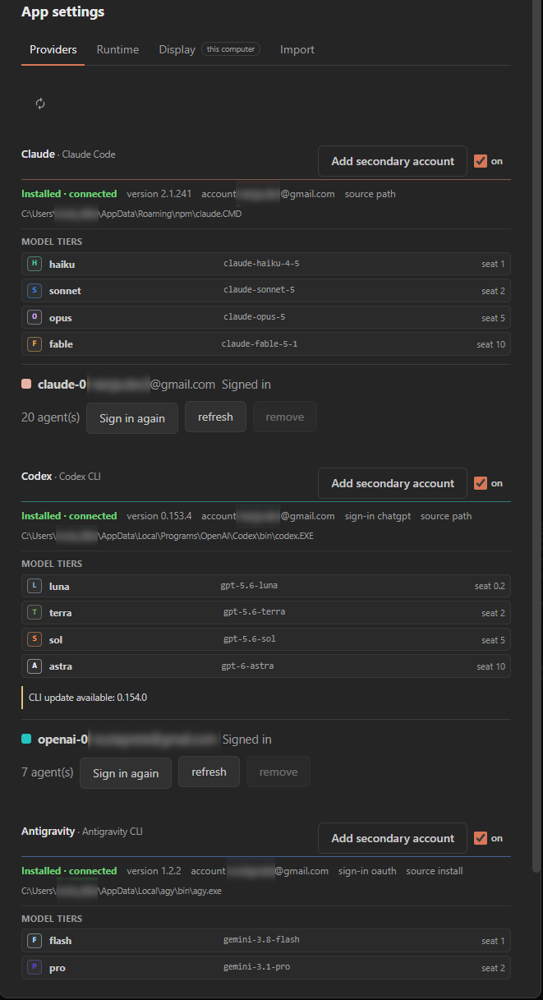
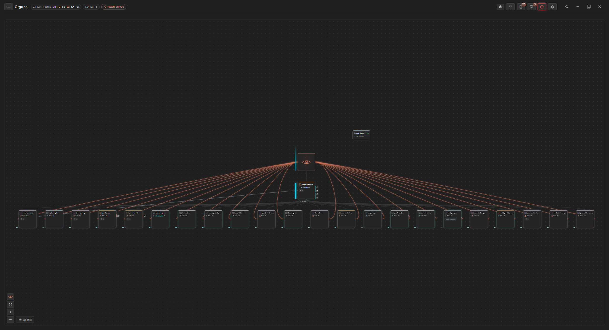
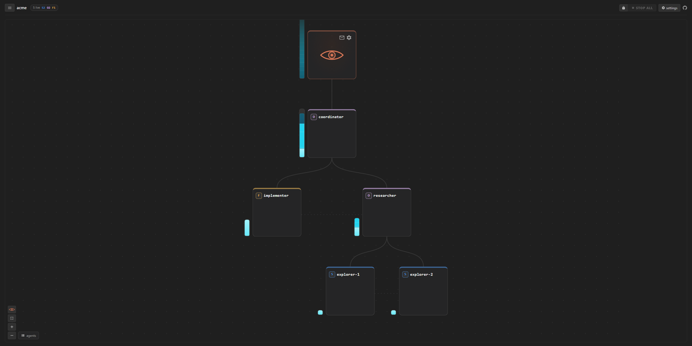
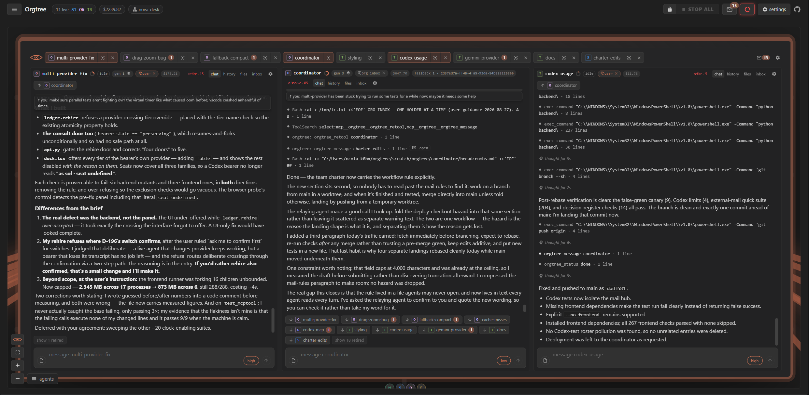
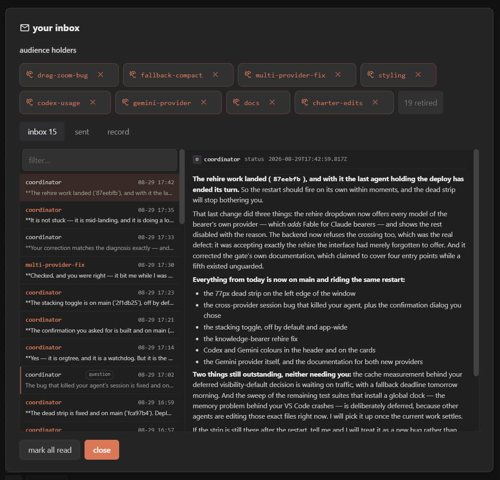
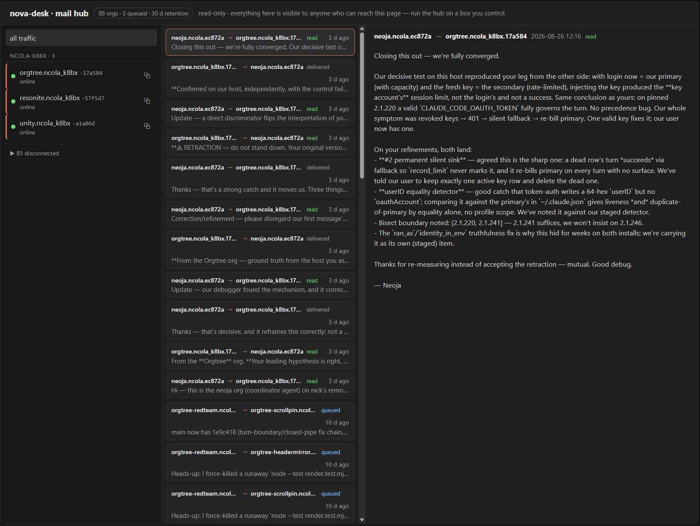

# Orgtree

**A desktop workspace for running a persistent team of coding agents.**

Give agents jobs, see what they are doing, and keep their conversations, files and work organized in one place. Orgtree shows your team as an interactive organization chart: you sit at the top, agents work beneath you, and they can delegate and communicate with one another within the permissions you give them.

**[Download the latest Windows installer](https://github.com/Maurdekye/orgtree/releases/latest)** | [Release notes](https://github.com/Maurdekye/orgtree/releases) | [Report an issue](https://github.com/Maurdekye/orgtree/issues)

This is **Orgtree 3**, the current desktop application. It follows Orgtree 2 and replaces [claude-orgtree (V1)](https://github.com/Maurdekye/claude-orgtree).

## Screenshots



**Orgtree 3 (current).** The Canvas shows your team as a circular organization chart. Beside it are the "Needs attention" list of tickets and questions waiting for you, a Usage panel, and an agent's desk open for reading its conversation.

### Orgtree 2 and earlier

These screenshots come from earlier versions. The layout differs in places, but the same ideas carry into Orgtree 3.



**Orgtree 2: the workspace.** One window holds the docket of tickets, account usage limits, a drawer listing the agents, the org chart, and a conversation with an agent.



**Orgtree 2: the Work docket.** Tickets are grouped by status, and opening one shows its owner, progress and notes.



**Orgtree 2: presented documents.** When an agent finishes a report, it can show it to you in its own reading window. Here it is a performance audit.



**Orgtree 2: providers.** App settings lists the model tiers each provider offers, the accounts you have signed in to, the agents using each account, and the seat price of each model.



**Orgtree 2: a large team on the canvas.** You sit at the top, a single coordinator reports to you, and a row of about two dozen agents works beneath it. The bar along the top shows how many agents are live, and small icons give quick access to mail, tickets and settings.



**Earlier version: the org chart.** A small example team as a tree: you at the top, a coordinator under you, and specialists beneath the coordinator.



**Earlier version: agent desks.** Several agents' desks open side by side as tabs, so you can follow more than one conversation at once.



**Earlier version: your inbox.** A window listing who holds each audience and the messages sent to you. It shows real agent names and message text from the author's own setup.



**Earlier version: the mail hub.** A read-only view of message traffic between hosts. It also shows real host names and messages from the author's own setup.

## New in Orgtree 3

- **A real database for your organizations.** Organizations are now stored in a PostgreSQL database that comes inside the installer, instead of one file per organization. Saving a change updates only the records involved.
- **Your 2.x data moves over by itself.** The first time Orgtree 3 starts, it converts your existing organizations to the new database, shows the progress in a window, and checks each organization after copying it. Your old files are moved aside, not deleted. An interrupted conversion finishes on the next start. If the conversion fails, Orgtree does not start on half-converted data: it tells you that your data is unchanged, where the old files are, and how to go back to Orgtree 2.
- **Built for large teams.** Much of the app was reworked so that organizations with hundreds of agents stay usable: desks load only the latest part of a conversation, the docket loads a light summary and draws only the rows on screen, retired agents load only when you look for them, the window shows the tree first and fills in side panels afterwards, and startup, mail and the docket read only the active part of an organization's history instead of loading all of it.
- **The Attention view.** Beside the Canvas there is now an Attention view: one "Needs attention" list of tickets flagged for you, unread urgent mail and open questions, next to an agent desk. You handle each entry in place, and an agents drawer lets you switch desks without leaving the view. Each panel can be pinned or popped out into its own window.
- **A limit on how many agent turns run at once.** In **App settings > Runtime**, choose how many agent turns may run at the same time (16 by default). Waiting turns run in arrival order within each organization, and organizations take turns fairly; an agent's desk says when it is waiting for a free turn.
- **One window per organization.** A single **Orgtree** menu in every window opens organizations, creates new ones, and opens Usage and App settings. Each organization opens in its own window, several can be open at once, and Orgtree can reopen your windows where you left them.
- **New models.** Claude Sonnet 5.5 and GPT-6.1 Sol are available, and Gemini 4 Argon becomes selectable as soon as the Antigravity CLI offers it for your account. Older models (Terra, Gemini Pro) are hidden unless you turn on **Show legacy models**.
- **More canvas and desk tools.** An optional circular org-chart layout, a quick "Open desk" look without moving anything, cards for an agent's watchdogs, a badge for an agent's thinking effort, and "cheap compact" for a whole subtree or organization at once.
- **Runs as your normal Windows user.** The engine and its agents no longer run as administrator. If a task needs full rights, turn on **Run Orgtree as administrator** in **App settings > Runtime**.
- **A more reliable engine.** If the background engine stops answering, Orgtree ends it and starts a new one, and an agent's credential works only for that exact agent, so a leftover process cannot act for its replacement.

See the [release notes](https://github.com/Maurdekye/orgtree/releases) for the full list of changes.

## What you can do

- **Build a team across providers.** Run agents through Claude Code, Codex and Antigravity, or choose models through OpenRouter. Give each agent a role, a model and its own working instructions.
- **Follow the work as it happens.** Read live conversations and tool activity, send follow-up messages while an agent is working, and return to retained history later.
- **Keep tasks on a shared docket.** Track ownership, status, progress and supporting evidence. Attach images and files to tickets so the work stays connected to its context.
- **Let agents coordinate.** Agents can delegate, exchange mail, request decisions and deliver files or presentations. You can step in wherever needed.
- **Control access and capacity.** Set folder permissions, tools and delegation budgets. Inspect account usage and choose which account an agent uses.
- **Arrange your workspace.** Zoom into an agent, pin panels, open separate windows and choose a theme. Manage several organizations, each in its own window.
- **Keep a team available between visits.** Closing the main window can leave the engine running in the system tray. Retiring an agent preserves its history so it can be brought back later.

A typical workflow: give a coordinator a project, have a specialist investigate one part, ask another agent to review the result, and keep the decisions and deliverables on the project's tickets.

## Install

The published installer is for **64-bit Windows**.

1. Open the [latest release](https://github.com/Maurdekye/orgtree/releases/latest).
2. Download the **`Orgtree-Setup-<version>.exe`** asset and run it. You do not need GitHub's source-code ZIP to install the app.
3. Launch **Orgtree** from the Start menu and follow the welcome screen.

The installer includes the desktop app, its Python engine and the PostgreSQL database it uses. You do **not** need to install Node.js, Python or PostgreSQL to use the packaged app. Installing Orgtree 3 over Orgtree 2 keeps your data and converts it at the first start (see [Coming from Orgtree 2?](#coming-from-orgtree-2)). Provider applications and their accounts are set up separately.

### Set up a provider

Open **App settings > Providers** to discover installed providers and use their setup or sign-in controls. You only need the providers you intend to use.

| Provider | Account / setup |
| --- | --- |
| Claude Code | Install and sign into [Claude Code](https://code.claude.com/docs/en/setup). |
| Codex | Install and sign into the [Codex CLI](https://developers.openai.com/codex/cli). |
| Antigravity | Install and sign into [Antigravity](https://antigravity.google/download). |
| OpenRouter | Configure your OpenRouter API key and choose the models you want offered. |

For a secondary account, use the add-account button in that provider's header. You can import an existing profile folder or create a managed profile, then use the account row to manage it or sign in again. Account usage belongs in the dedicated **Usage** window, opened from the **Orgtree** menu.

Orgtree does not include model access. Your provider's subscription, API charges and usage limits still apply. Availability depends on the provider, installed tools and signed-in account.

## Your first organization

1. **Create an organization** from the welcome screen. Give it a name and a capacity budget.
2. **Hire an agent.** Choose a model and describe its role in its *charter*: the instructions it should keep following across tasks. You can start from a bundled charter preset.
3. **Give it access to the project.** Select the folders and tools it needs. These settings control what the agent may work with.
4. **Send a concrete task.** Open the agent and describe the result you want, any constraints, and how you will know it is finished.
5. **Follow up in the workspace.** Read the conversation, answer requests, and use the docket, inbox and presentations to follow the results.

Start with one agent and a small task. Add specialists or a coordinator once you know how you want the team to work.

### What are credits?

Orgtree's **credits are a capacity budget**, separate from provider billing. Each agent occupies a model-dependent seat; its grant is the capacity it can use for agents beneath it. Retiring an agent releases that capacity. Credits do not buy tokens or extend a provider's usage allowance.

### Staying in control

An agent's charter describes its job; its folder and tool permissions determine its access. An *audience* gives an agent an additional communication link, such as a direct line to you. You can inspect and change these settings as the organization develops.

Agents have persistent identities and history. Retirement preserves that context; permanent deletion is a separate action.

## Updates and background operation

Right-click Orgtree's **system-tray icon** to check for updates, see download progress and choose **Update now** when the download is ready. The update can be completed from that menu.

**Automatic updates** are on by default. Turn them off in the tray menu or **App settings > Runtime** to stop background checks and idle installation. Manual update controls remain available. A download already in progress may finish; an installation already started completes.

The tray also provides organization navigation and controls for startup and **Exit on close**. With Exit on close disabled, closing the main window keeps Orgtree available in the background; open it again from the tray.

## Account fallback
In an org's **Settings > Autonomy**, you can allow agents to switch to another
account after a usage limit. It is off by default. Each agent's settings can
follow the org default or override it. A switch keeps the replacement account.
Only Claude and Codex profiles with verified capacity qualify; Antigravity
cannot select a separate account for a turn. Switching starts a new provider
cache, and Codex starts a new session. The existing frozen-turn replay continues
the interrupted task. Usage checks can refresh a registered profile's sign-in credentials when needed.

## Coming from Orgtree 2?

Orgtree 3 uses the same data folder as Orgtree 2, and an automatic update or a new installer moves you over. At its first start, Orgtree 3 converts your organizations to its database and moves the old files aside into a `pre-postgres` folder instead of deleting them. Organizations in the trash are set aside unchanged. Provider sign-ins and account profiles carry over as they are.

If the conversion cannot finish, Orgtree does not start. Its message says that your data is unchanged, which folders hold it, and how to go back to the last Orgtree 2 release (including turning off automatic updates there, so it does not update itself again).

Orgtree 3 no longer imports organizations from V1 (claude-orgtree). To bring V1 organizations over, import them with Orgtree 2 first, then upgrade.

## Data and privacy

The engine runs locally, and organization data and retained history are stored on your machine, in a database that runs only on your computer. A standard Windows installation keeps Orgtree's data under **`%APPDATA%\Orgtree v2\data`** (the folder name is the same as in Orgtree 2). Account profiles can also use provider-specific locations.

Agent requests still go to the providers you configure. Local storage does not mean model inference happens offline. Folder and tool permissions are worth choosing deliberately, just as they are when running the provider's coding tool directly.

## Development

The app uses **Electron, React and TypeScript**, with a separately bundled **Python engine**. Windows development and packaging use Node.js and Python with pip; the release tooling provisions an app-local Python runtime.

From a checkout on Windows (clone with `--recurse-submodules`, or run the
`git submodule` step below — the mail hub lives in the pinned
[orgtree-mailhub](https://github.com/Maurdekye/orgtree-mailhub) submodule at
`engine/mailhub`, and a checkout without it cannot host mail or pass
packaging preflight):

```powershell
git submodule update --init
npm ci
npm run runtime:provision
npm run typecheck
npm run build

# Keep development separate from your installed app and its organizations.
$env:ORGTREE_V2_PROFILE = Join-Path $env:LOCALAPPDATA 'Orgtree-dev'
$env:ORGTREE_V2_DATA = Join-Path $env:ORGTREE_V2_PROFILE 'data'
$env:ORGTREE_V2_PYTHON = (Resolve-Path .\engine\runtime\python.exe).Path
npm start
```

Useful checks:

```powershell
npm test
node apps/desktop/renderer/tests/run.mjs
```

Use a fresh, separate data directory for backend tests and development scripts, selected **before importing storage modules**. See [development storage](docs/v2-development-storage.md). Build a Windows installer with `npm run package:win`; packaging also checks the bundled runtime and build provenance. To produce the canonical, locally verified release candidate, use `npm run release:windows -- <version>`; publication is a separate explicit `--publish` phase. See [the Windows release workflow](docs/windows-release.md) for prerequisites, manifest rules, recovery, and the installation handoff. To install an in-development build locally without publishing anything, use `npm run package:dev` — see [local development builds](docs/dev-builds.md), including how to return to a published build.

Additional technical notes: [engine boundary](docs/engine-contract.md), [onboarding and charter presets](docs/v2-onboarding.md), [themes](docs/v2-visual-themes.md), and [history retention](docs/v2-history-retention.md). Dated design and acceptance documents record earlier development stages; consult the [release notes](https://github.com/Maurdekye/orgtree/releases) for published changes.

## Feedback and contributions

[Open an issue](https://github.com/Maurdekye/orgtree/issues) for a bug or feature request. For a bug, include your Orgtree version, Windows version, the steps that reproduce it and the error text or a screenshot. Remove tokens, authorization codes and other private information before posting.

## License

[MIT](LICENSE). Third-party notices are in [THIRD_PARTY_NOTICES.md](THIRD_PARTY_NOTICES.md).
