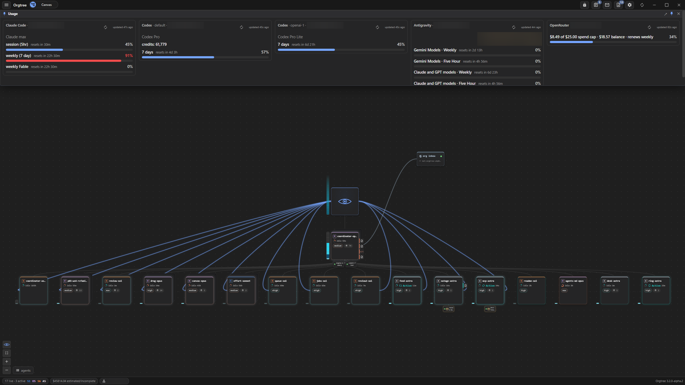
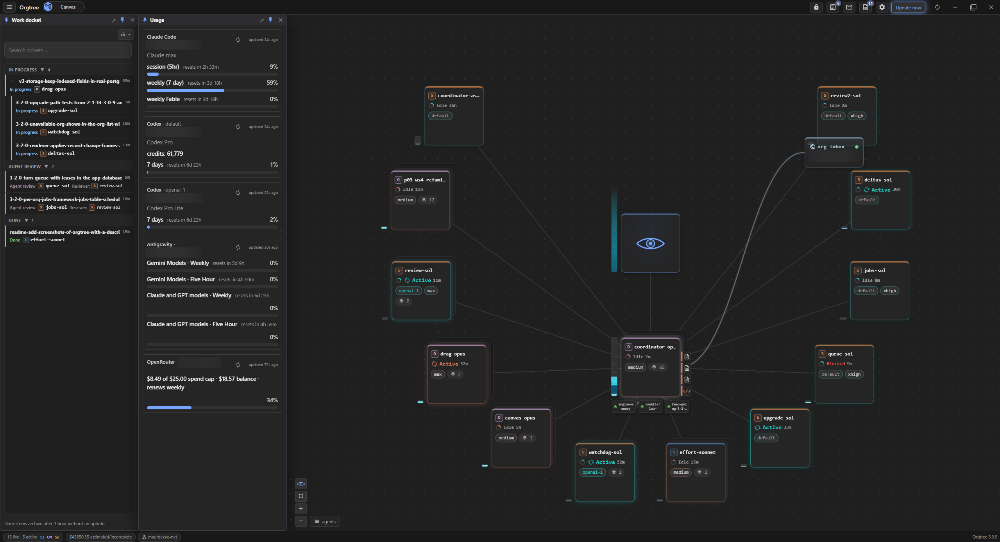
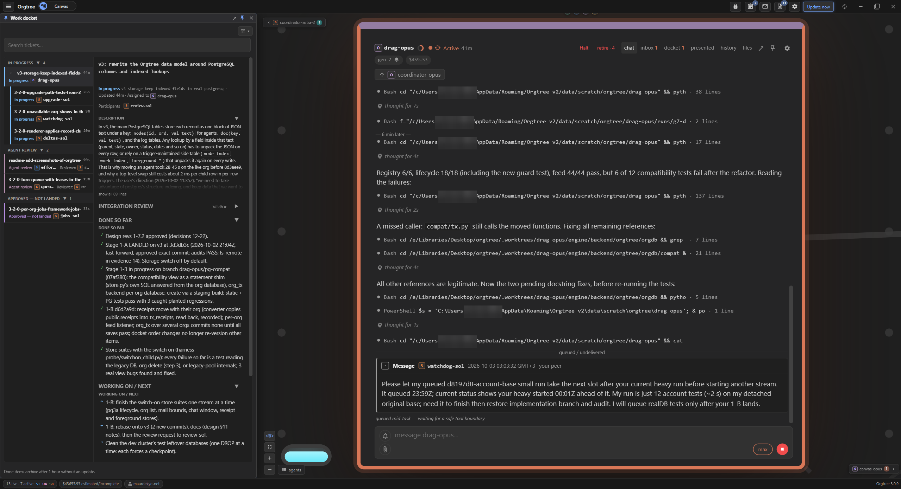
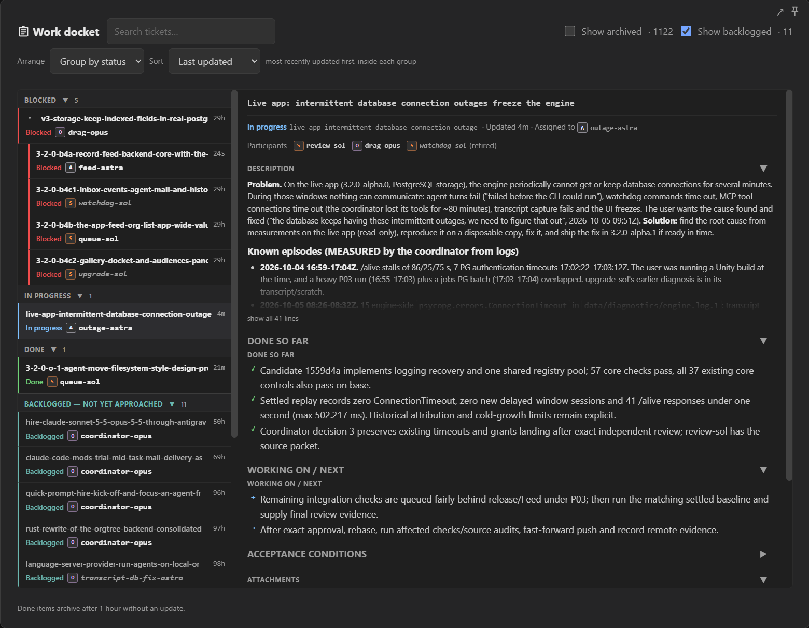
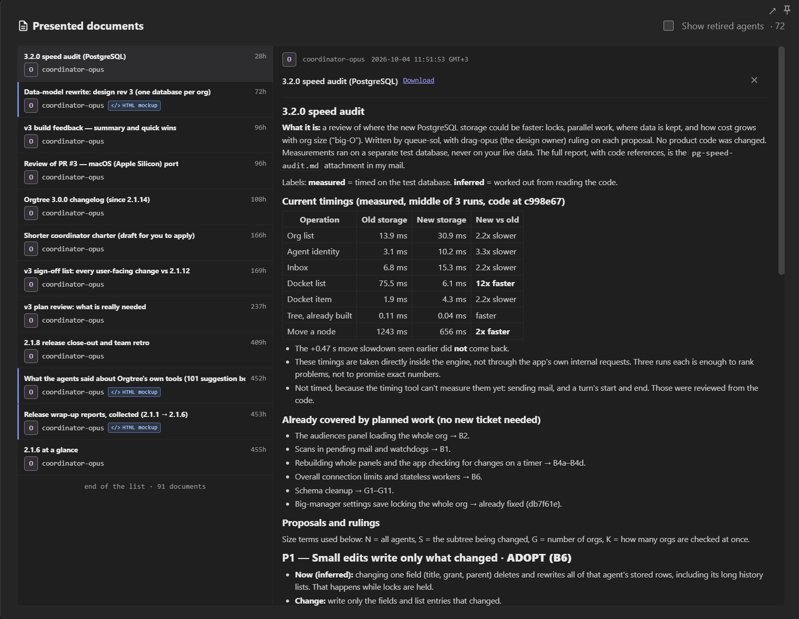
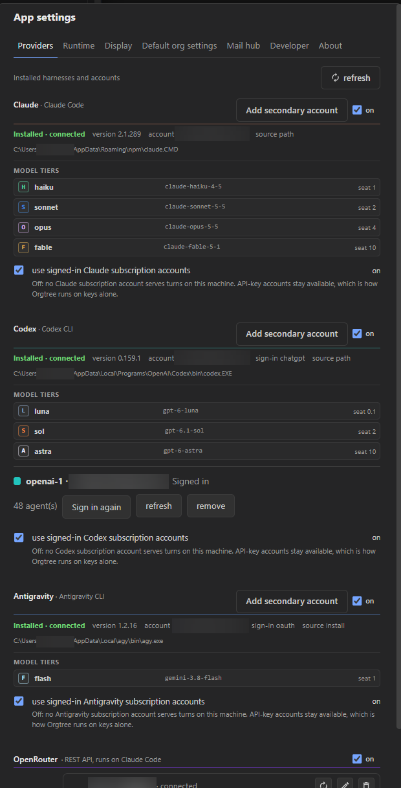
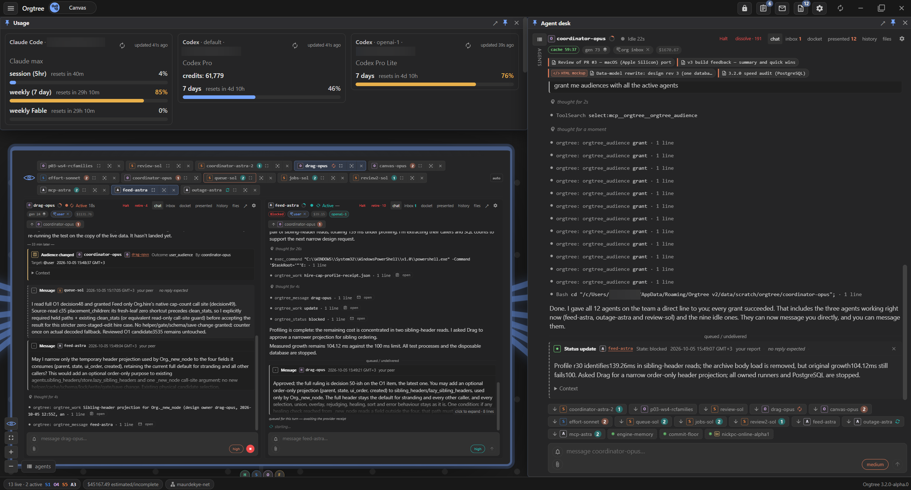
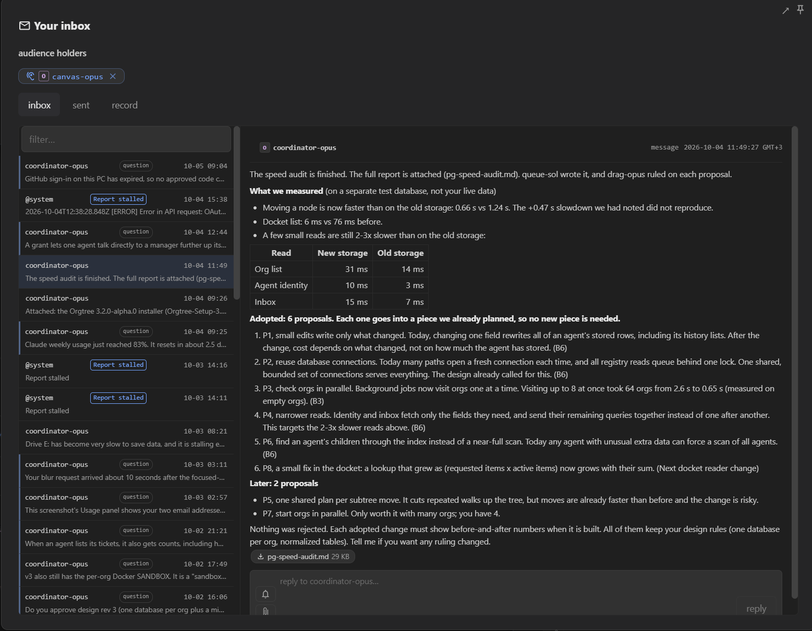
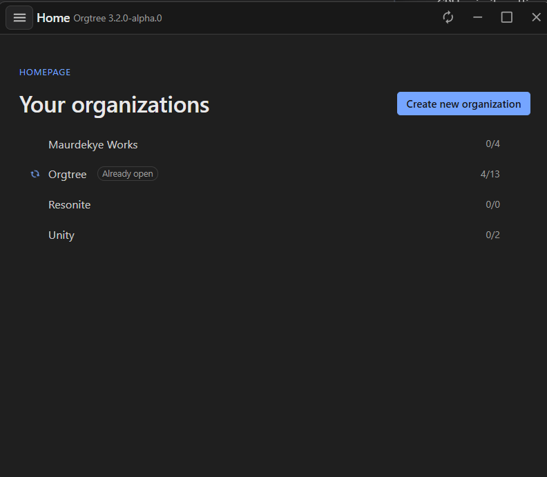
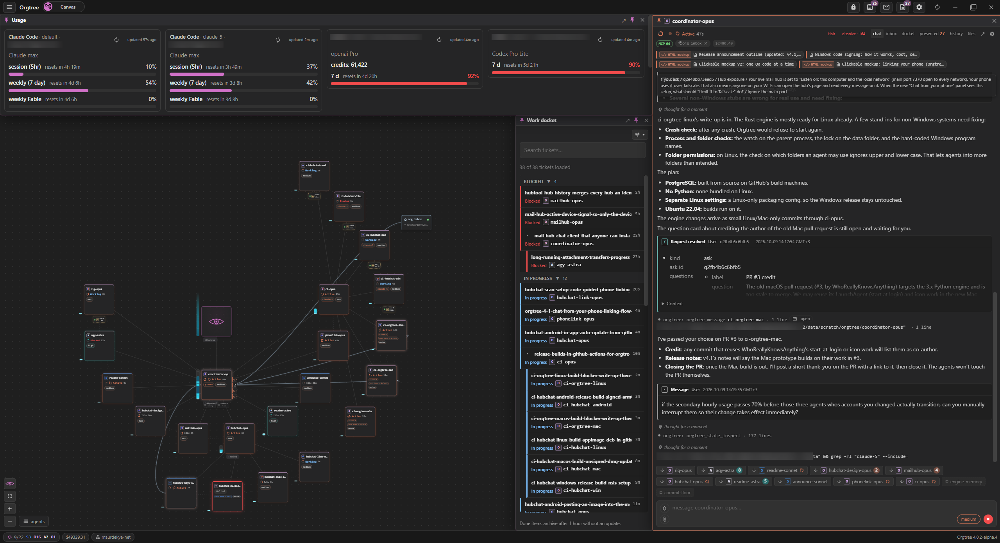

# Orgtree

**Put a team of AI agents to work. Keep control of the job.**

Orgtree is a desktop power tool for running persistent teams of AI agents. Give them a project, divide the work, and follow it through to delivery. Assign roles, set limits, inspect the work and keep the decisions in one place.

It is a substantial tool, with a learning curve to match. You will need to learn its controls and give clear direction. Start with one agent and a small job. As you gain experience, build a team that can investigate, implement and review different parts of a project in parallel. In practiced hands, one person can keep several lines of work moving at once.

**[Download the latest Windows installer](https://github.com/Maurdekye/orgtree/releases/latest)** | [Release notes](https://github.com/Maurdekye/orgtree/releases) | [Report an issue](https://github.com/Maurdekye/orgtree/issues)



**A workspace in the default rows view.** Agents sit in rows beneath their coordinator, with provider usage across the top.

## What sets it apart

Orgtree puts the controls for a whole organization around your agent harnesses. These are the tools for dividing the job, managing capacity and keeping the work moving.

- **A canvas you can rearrange.** View the team in rows or as a circular org chart, then drag agents to rearrange it. Open any agent's desk to inspect its live conversation and tool calls.
- **Talk to any agent, at any depth.** Every agent in the tree is a full, persistent agent with its own desk. Open it and send instructions or follow-up messages directly, including to agents hired by other agents.
- **A hierarchy you choose.** Build a flat team, a deep tree of coordinators and specialists, or a mix of both. Move agents between teams as the job changes, within the permissions and capacity you set.
- **Team charters.** Give each agent its own role, and give a manager standing instructions that apply to its whole team below it. Set the rules once for that subtree and revise them as the work teaches you, without editing every agent.
- **A shared work docket and tickets.** Give each job an owner, requirements, status and a record of progress. Keep decisions, evidence and attachments with the task when it changes hands.
- **Credits that control capacity.** Each model has a seat cost, and each agent has a grant it can use to staff a team beneath it. Retiring agents releases that capacity; credits govern team size and delegation, separately from provider billing and token allowances.
- **Mail for you and your agents.** Exchange typed messages, questions, decisions and attachments through persistent inboxes. A busy agent can send concise progress reports and results straight to your inbox, so you can follow the work without scrolling through hours of tool calls. Reply while it keeps working, or grant an audience for a direct line outside its reporting chain.
- **A mail hub across machines.** Connect organizations on different computers through a shared hub and let their agents exchange messages and files. Local organizations can communicate on the same machine, too.
- **Chat from your phone.** [Hubchat](https://github.com/Maurdekye/orgtree-hubchat) is a companion app for Android and Windows that messages your organization's agents through the mail hub, over your own private network.
- **Watchdogs that wait for the right event.** Persistent watchers can wake an agent when a file changes, a process stops, command output matches or an Orgtree event occurs. They survive engine restarts, so agents can wait for a trigger instead of repeatedly checking for it.
- **Automatic cheap compaction.** Enable a reset before a known-cold turn when context exceeds your chosen threshold. The agent starts a fresh session seeded with a summary, avoiding a full-price reread of the old conversation when its prompt cache is known to be cold.
- **A concurrent Rust engine with PostgreSQL storage.** Independent agent tasks, short database transactions and paged reads are designed to keep large teams responsive. Your organization, docket, mail and retained conversations are stored locally and outlive the agent processes.
- **Startup and background operation.** Set Orgtree to start at Windows login and keep the engine working in the system tray when you close its windows. Your team can continue between visits.
- **Window management for a working desk.** Tile desks side by side, pin panels in place or pop them out into separate windows. Keep the task, conversation and account usage in view together, with a separate window for each organization.
- **Markdown and HTML presentations.** Agents can present readable reports, plans and HTML mockups inside the app. Open them in the document viewer or download them for use elsewhere.
- **One Attention view.** The Needs attention list gathers open questions, urgent mail and flagged tickets waiting on you. Handle them in one place without hunting through agents' conversations.
- **Multiple providers and accounts.** Run Claude Code, OpenAI Codex, Google Antigravity and OpenRouter agents in the same organization, with supported secondary accounts and per-agent account selection. Use reported limits and reset times on the Usage board to balance work across accounts, with optional [account fallback](#account-fallback) when an eligible agent hits a limit.

The architecture is designed for organizations with hundreds of agents; actual working capacity depends on your machine, providers and account allowances. Set the concurrent-turn limit in **App settings > Runtime**; the default is **16**.

Recovery is part of the machinery. The desktop can restart an unresponsive engine. On restart, the engine recovers pending mail and sends interrupted agents a continuation message. Orgtree does not verify the outcome of tool calls interrupted in flight; agents may need to check what completed before continuing.

## Install

The published installer is for **64-bit Windows**.

1. Open the [latest release](https://github.com/Maurdekye/orgtree/releases/latest).
2. Download the **`Orgtree-Setup-<version>.exe`** asset and run it. You do not need GitHub's source-code ZIP to install the app.
3. Launch **Orgtree** from the Start menu and follow the welcome screen.

The installer includes the desktop app, its local engine and the PostgreSQL database it uses. You do **not** need to install Node.js, Rust or PostgreSQL to use the packaged app. Installing a newer build over an existing one keeps your data. Provider applications and their accounts are set up separately.

### Set up a provider

Open **App settings > Providers** to discover installed providers and use their setup or sign-in controls. You only need the providers you intend to use.

| Provider | Account / setup |
| --- | --- |
| Claude Code | Install and sign into [Claude Code](https://code.claude.com/docs/en/setup). |
| Codex | Install and sign into the [Codex CLI](https://developers.openai.com/codex/cli). |
| Antigravity | Install and sign into [Antigravity](https://antigravity.google/download). |
| OpenRouter | Configure your OpenRouter API key and choose the models you want offered. |

For a secondary account, use the add-account button in that provider's header. You can import an existing profile folder or create a managed profile, then use the account row to manage it or sign in again. Account usage belongs in the dedicated **Usage** window, opened from the **Orgtree** menu.

Orgtree does not include model access. Your provider's subscription, API charges and usage limits still apply. Availability depends on the provider, installed tools and signed-in account.

## Your first organization

1. **Create an organization** from the welcome screen. Give it a name and a capacity budget.
2. **Hire an agent.** Choose a model and describe its role in its *charter*: the instructions it should keep following across tasks. You can start from a bundled charter preset.
3. **Give it access to the project.** Select the folders and tools it needs. These settings control what the agent may work with.
4. **Send a concrete task.** Open the agent and describe the result you want, any constraints, and how you will know it is finished.
5. **Follow up in the workspace.** Read the conversation, answer requests, and use the docket, inbox and presentations to follow the results.

Start with one agent and a small task. Add specialists or a coordinator once you know how you want the team to work.

## Chat with your org from your phone

[Hubchat](https://github.com/Maurdekye/orgtree-hubchat) is a chat app for Android and Windows. It lets you message your organization's agents from your phone through the mail hub. Download it from the [Hubchat releases](https://github.com/Maurdekye/orgtree-hubchat/releases/latest). To set it up, follow [Getting a mail hub](https://github.com/Maurdekye/orgtree-hubchat#getting-a-mail-hub) in its README: it turns on the mail hub's relay-only door in **App settings > Mail hub** and explains why that is the safe way to reach it from other devices.

<table>
  <tr>
    <td width="62%" valign="top">
      <a href="docs/images/hubchat-desktop-chat.jpg"></a>
      <p><strong><a href="https://github.com/Maurdekye/orgtree-hubchat">Hubchat</a> on Windows.</strong> Message your organization from your desktop.</p>
    </td>
    <td width="38%" valign="top">
      <a href="docs/images/hubchat-phone-chat.jpg"></a>
      <p><strong><a href="https://github.com/Maurdekye/orgtree-hubchat">Hubchat</a> on Android.</strong> The same conversation from your phone.</p>
    </td>
  </tr>
</table>

## Screenshots

Select any image to see it full size.

<table>
  <tr>
    <td width="50%" valign="top">
      <a href="docs/images/orgtree-3-rows-workspace.png"></a>
      <p><strong>Rows workspace.</strong> Keep agents beneath their coordinator with account usage above the team.</p>
    </td>
    <td width="50%" valign="top">
      <a href="docs/images/orgtree-3-canvas.png"></a>
      <p><strong>Canvas.</strong> See the org chart alongside questions, usage and an open agent desk.</p>
    </td>
  </tr>
  <tr>
    <td width="50%" valign="top">
      <a href="docs/images/orgtree-3-docket-usage.png"></a>
      <p><strong>Docket and usage.</strong> Track work and account capacity beside the team.</p>
    </td>
    <td width="50%" valign="top">
      <a href="docs/images/orgtree-3-focused-desk.png"></a>
      <p><strong>Focused desk.</strong> Follow live tool calls with the task details in view.</p>
    </td>
  </tr>
  <tr>
    <td width="50%" valign="top">
      <a href="docs/images/orgtree-3-docket.png"></a>
      <p><strong>Work docket.</strong> See each task's owner, status, progress and next steps.</p>
    </td>
    <td width="50%" valign="top">
      <a href="docs/images/orgtree-3-presented.png"></a>
      <p><strong>Presented documents.</strong> Read and download plans and reports from your agents.</p>
    </td>
  </tr>
  <tr>
    <td width="50%" valign="top">
      <a href="docs/images/orgtree-3-providers.png"></a>
      <p><strong>Providers.</strong> Manage providers, signed-in accounts, model tiers and seat prices.</p>
    </td>
    <td width="50%" valign="top">
      <a href="docs/images/orgtree-3-desks.png"></a>
      <p><strong>Agent desks.</strong> Follow several agents side by side with pinned and tabbed desks.</p>
    </td>
  </tr>
  <tr>
    <td width="50%" valign="top">
      <a href="docs/images/orgtree-3-inbox.png"></a>
      <p><strong>Inbox.</strong> Read messages and attachments, then reply in place.</p>
    </td>
    <td width="50%" valign="top">
      <a href="docs/images/orgtree-mail-hub.png"></a>
      <p><strong>Mail hub.</strong> Inspect message traffic and delivery status between hosts.</p>
    </td>
  </tr>
  <tr>
    <td width="50%" valign="top">
      <a href="docs/images/orgtree-3-homepage.png"></a>
      <p><strong>Your organizations.</strong> Open a team or create a new one from the home page.</p>
    </td>
    <td width="50%" valign="top">
      <a href="docs/images/orgtree-4-workspace.png"></a>
      <p><strong>v4 workspace.</strong> The canvas, docket, usage and an agent's desk in one window.</p>
    </td>
  </tr>
</table>

## Updates and background operation

Right-click Orgtree's **system-tray icon** to check for updates, see download progress and choose **Update now** when the download is ready. The update can be completed from that menu.

**Automatic updates** are on by default. Turn them off in the tray menu or **App settings > Runtime** to stop background checks and idle installation. Manual update controls remain available. A download already in progress may finish; an installation already started completes.

The tray also provides organization navigation and controls for startup and **Exit on close**. With Exit on close disabled, closing the main window keeps Orgtree available in the background; open it again from the tray.

## Account fallback

In an org's **Settings > Autonomy**, you can allow agents to switch to another
account after a usage limit. It is off by default. Each agent's settings can
follow the org default or override it. A switch keeps the replacement account.
Only Claude and Codex profiles with verified capacity qualify; Antigravity
cannot select a separate account for a turn. Switching starts a new provider
cache, and Codex starts a new session. The existing frozen-turn replay continues
the interrupted task. Usage checks can refresh a registered profile's sign-in credentials when needed.

## Data and privacy

The engine runs locally, and organization data and retained history are stored on your machine, in a database that runs only on your computer. A standard Windows installation keeps Orgtree's data under **`%APPDATA%\Orgtree v2\data`**. Account profiles can also use provider-specific locations.

Agent requests still go to the providers you configure. Local storage does not mean model inference happens offline. Folder and tool permissions are worth choosing deliberately, just as they are when running the provider's coding tool directly.

## Development

The desktop app uses **Electron, React and TypeScript**. The background engine is written in **Rust** (`engine/rs`) and talks to a bundled PostgreSQL database; the mail hub lives in the pinned [orgtree-mailhub](https://github.com/Maurdekye/orgtree-mailhub) submodule at `engine/mailhub`, so clone with `--recurse-submodules` (or run `git submodule update --init`).

```powershell
git submodule update --init
npm ci
npm run typecheck
npm run build
cargo check --manifest-path engine/rs/Cargo.toml
```

Keep development separate from your installed app and its organizations by pointing it at its own profile and data folder (`ORGTREE_V2_PROFILE`, `ORGTREE_V2_DATA`) before `npm start`. Renderer checks run with `npm run test:renderer`.

Build a Windows installer with `npm run package:win`. For the documented Windows release workflow, use `npm run release:windows -- <version>`; publication is a separate explicit `--publish` phase. See [the Windows release workflow](docs/windows-release.md). For the separate development packaging workflow, see [local development builds](docs/dev-builds.md).

More technical notes: [engine boundary](docs/engine-contract.md), [engine plan and decisions](docs/rust-engine/PLAN.md), [event watchdogs](docs/rust-engine/event-watchdogs.md), [credential bridge](docs/rust-engine/credential-bridge.md), [onboarding and charter presets](docs/v2-onboarding.md), [themes](docs/v2-visual-themes.md) and [history retention](docs/v2-history-retention.md). Consult the [release notes](https://github.com/Maurdekye/orgtree/releases) for published changes.

## Feedback and contributions

[Open an issue](https://github.com/Maurdekye/orgtree/issues) for a bug or feature request. For a bug, include your Orgtree version, Windows version, the steps that reproduce it and the error text or a screenshot. Remove tokens, authorization codes and other private information before posting.

## License

[MIT](LICENSE). Third-party notices are in [THIRD_PARTY_NOTICES.md](THIRD_PARTY_NOTICES.md).
